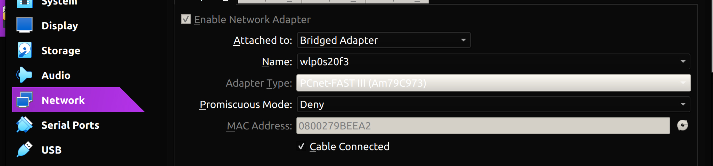

University: [ITMO University](https://itmo.ru/ru/)  
Faculty: [FICT](https://fict.itmo.ru)  
Course: [Network programming](https://github.com/itmo-ict-faculty/network-programming)  
Year: 2024/2025  
Group: K3320
Author: Kirollos Rezkallah  
Lab: Lab1  
Date of create: 25.03.2025
Date of finished: 06.04.2025

## Lab #1 "Installing CHR and Ansible, setting up a VPN"

## <a name="section1">Description</a>

This work includes training in the deployment of virtual machines (VM) and the Ansible configuration control system, as well as the organization of its own VPN servers.

## <a name="section2">The purpose of the work</a>

The purpose of this work is to deploy a virtual machine based on the Microsoft Azure platform with the Ansible configuration control system installed and install CHR in VirtualBox.

## <a name="section4">Progress of work</a>

### <a name="section4.1">Selectl VDS</a>

For convenience, it was decided to use the Select VDS service. After purchasing and installing the server, the ssh connection was played back.

<p align="center"></p>

<p align="center"></p>

The necessary components are also installed: python, ansible

<p align="center"></p>

### <a name="section4.2">VirtualBox и CHR (RouterOS)</a>

MikroTik's CHR (Cloud Hosted Router) is a virtual version of the RouterOS router designed for use in virtualized environments.

<p align="center"></p>

Switch the network mode to Bridge to connect directly to the physical network using the same network interface as the primary host.

<p align="center"></p>

Now you can connect to the VM using VinBox

<p align="center"></p>

### <a name="section4.3">Creating a Fireguard interface on RouterOS (client)</a>

Older versions of RouterOS already have a built-in Wiegand interface, so we turn it on and configure it (keys are automatically generated).

<p align="center"></p>

<p align="center"></p>

In addition to the interface itself, it is important to specify a peer with the endpoint ip, the port of our server, and the public key that will be generated on the server.

<p align="center"></p>

On the client side, the Allowed IPs parameter specifies which IP addresses will be sent through the WireGuard tunnel. This actually determines the routes that the client's traffic will travel through the tunnel.

### <a name="section4.4">Creating a Wireguard interface on Select VDS (server)</a>

We create a key pair on the server itself

```bash
/etc/wireguard/
wg genkey > privatekey
wg pubkey < privatekey > publickey
```

We will also create a configuration file with an interface in which we will specify the server's private key, IP from the same subnet, and peer, which will contain the client's public key and ip.

```bash
root@my-serv-spb:~# cat /etc/wireguard/wg0.conf
[Interface]

PrivateKey = EDY9niad14YAoKrj8Dr6LexrcglpsHDubtmm5Gy+/GQ=
Address = 10.0.0.1/24
ListenPort = 51820

[Peer]

PublicKey = yQr5zsil3vtV0T+Yh+eUpX0Jli8OlJY9RXellkCDlSE=
AllowedIPs = 10.0.0.2/32
```

On the server side, AllowedIPs specifies which IP addresses can be associated with a specific client (peer).

<p align="center"></p>

### <a name="section4.5">Tests</a>

- Server -> Client

<p align="center"></p>

- Checking the Internet connection

<p align="center"></p>

- Client -> Server

<p align="center"></p>

- Checking the Internet connection

<p align="center"></p>

## <a name="section4.6">Conclusion</a>

During this laboratory work, a server on the Selectel VDS platform was raised, Ansible and python configuration control system were installed on it, and a VM with CHR in VirtualBox was also raised. In these devices, the Wireguard interface was raised and a tunnel was set up between them.
