University: [ITMO University](https://itmo.ru/ru/)  
Faculty: [FICT](https://fict.itmo.ru)  
Course: [Network programming](https://github.com/itmo-ict-faculty/network-programming)  
Year: 2024/2025  
Group: K3320  
Author: Kirollos Rezkallah  
Lab: Lab2  
Date of create: 03.05.2025  
Date of finished: 05.05.2025

## Lab №2 "Deploying Additional CHR, the first Ansible scenario"

## <a name="section1">Description</a>

In this lab, you will get to know the Ansible configuration management system in practice, which is used to automate software configuration and deployment.

## <a name="section2">The purpose of the work</a>

Use Ansible to set up multiple network devices and collect information about them. Assemble the Inventory file correctly.

## <a name="section3">Progress of work</a>

### <a name="section3.1">Preparing the second CHR of devices</a>

According to the first laboratory work, we will raise the second VM from Mikrotik, connect to it via Winbox and configure Wireguard.

<p align="center">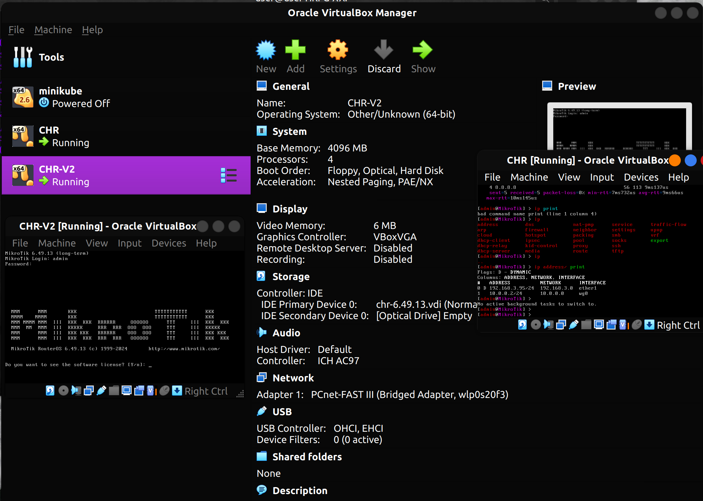</p>

We will configure the new interface of the CHR-V2 adapter for communication with the server, update the configuration file on the server itself.

<p align="center">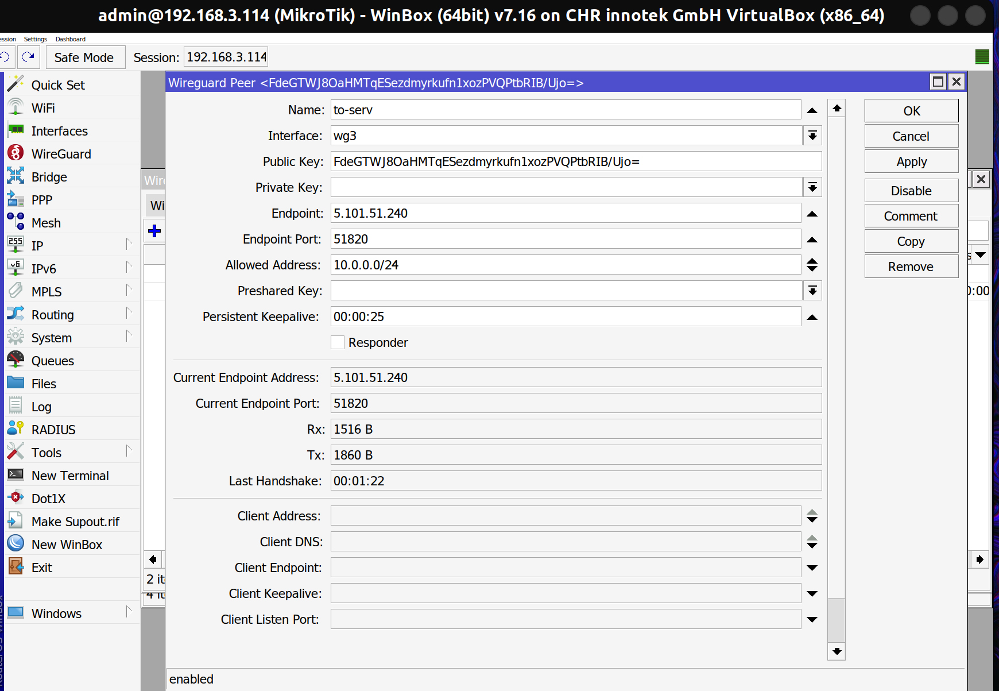</p>

<p align="center">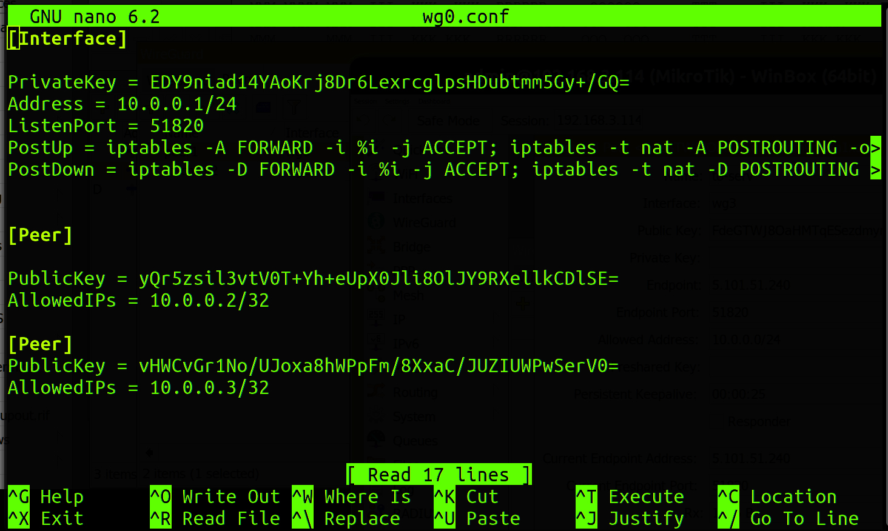</p>

Let's set up a new adapter interface for connecting two CHR VMs via Wireguard

Let's check the CR-V2 - Serv connection'

- CHR-V1 (192.168.3.95)

<p align="center">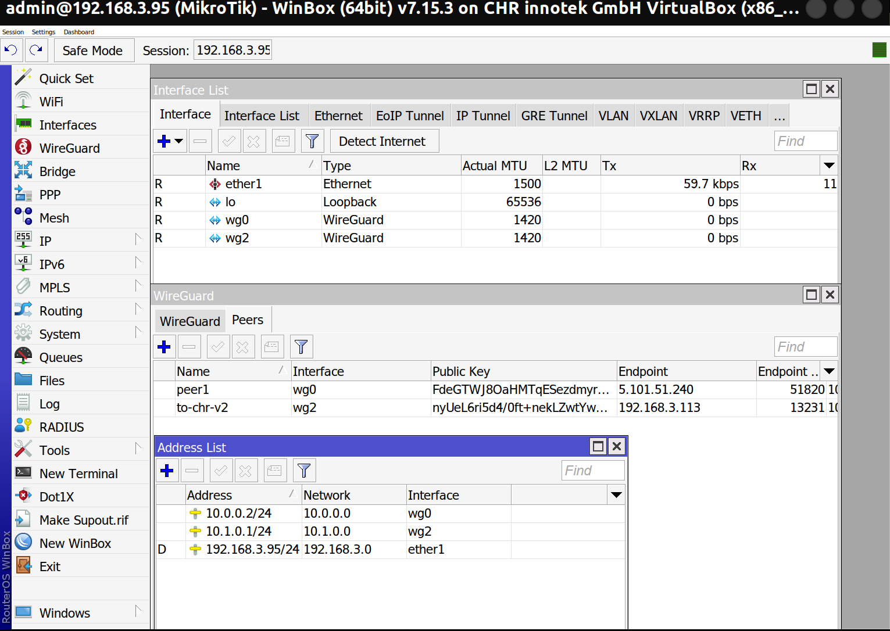</p>

- CHR-V2 (192.168.3.113)

<p align="center">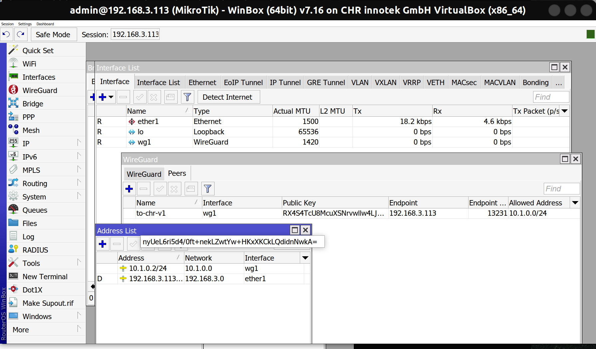</p>

We check the connection immediately

- CHR-V1 -> CHR-V2

<p align="center">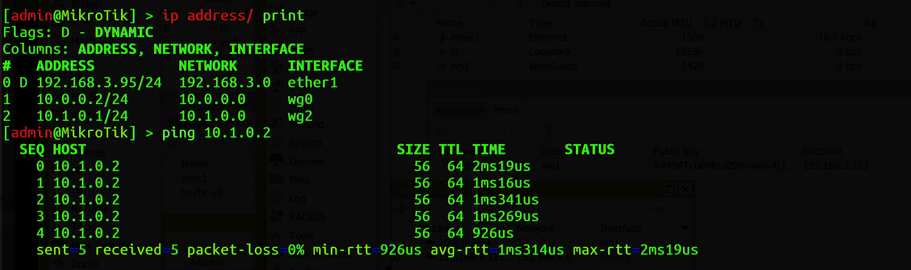</p>

- CHR-V2 -> CHR-V1

<p align="center">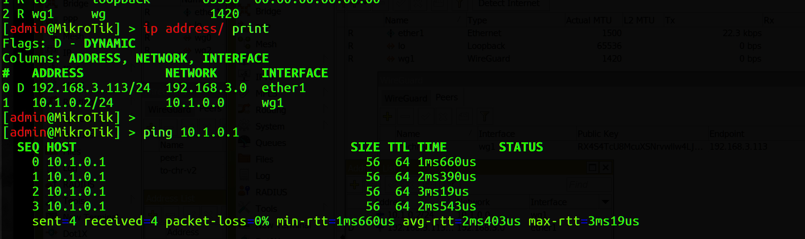</p>

You can clearly see that all devices are on the same local network, and you can allow work with different subnets by configuring routing between subnets.

```bash
iptables -A FORWARD -s 10.0.0.0/24 -d 10.2.0.0/24 -j ACCEPT
iptables -A FORWARD -s 10.2.0.0/24 -d 10.0.0.0/24 -j ACCEPT
```

### <a name="section3.2">Working with Ansible</a>

By default, Ansible uses SSH to connect to remote hosts, and WireGuard in this case acts as a secure channel through which an SSH connection is made.

Therefore, we will configure the keys so that there are no problems with passwords.

<p align="center">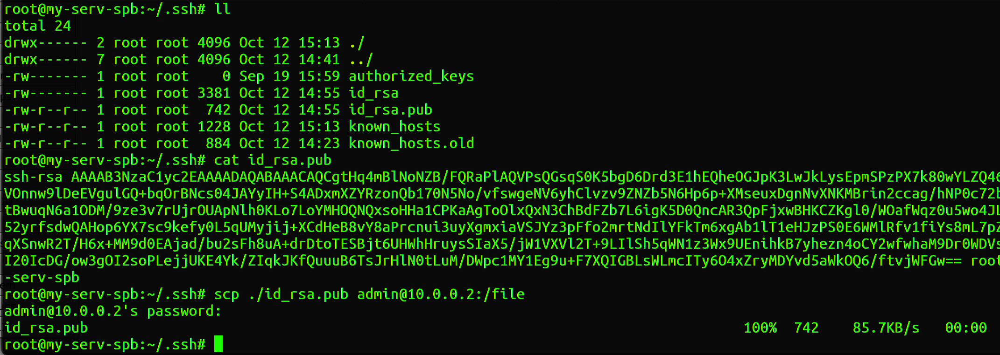</p>

The file name and extension were set manually, as it was not possible to do this using scp.

Import the server's public key and verify that the password is no longer required.

<p align="center">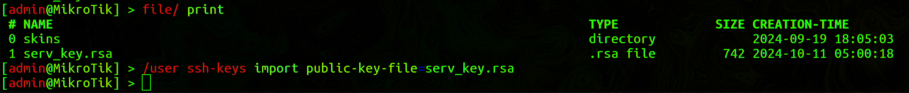</p>

<p align="center">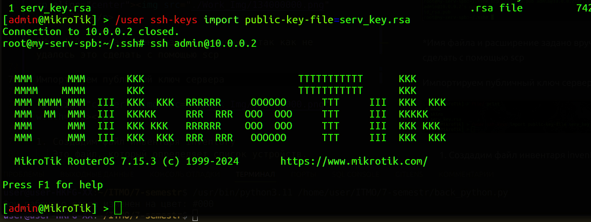</p>

(Similar for CHR-V2)

1. Create the hosts file in the inventory directory (to be updated later)

This is the file that defines the list of devices.

<p align="center">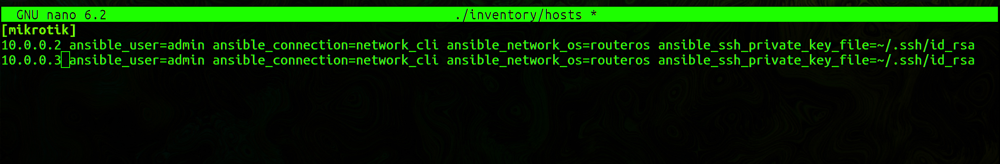</p>

- ansible_connection=network_cli indicates that the connection is suitable for network devices such as routers and switches.

- ansible_network_os=routeros defines the device's operating system as RouterOS

- ansible_ssh_private_key_file=~/.ssh/id_rsa specifies the path to the SSH private key used for authentication on MikroTik

2. We will also create the ansible.cfg configuration file.

<p align="center">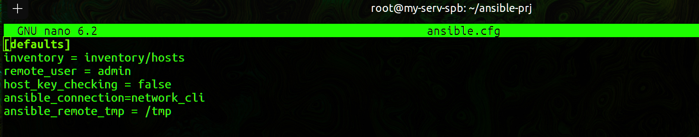</p>

The settings in ansible.cfg apply to all hosts unless they are redefined in the hosts file. In the hosts file, you can specify specific settings for individual hosts to have more control over connections.

Now you can check the connection using the command

```bash
ansible -i ./inventory/hosts mikrotik -m ping
```

<p align="center"></p>

3. Creating a playbook

This is the main file where the tasks are described.

At a minimum, each play defines two things:

- managed nodes for targeting
- using a template for at least one task to complete

In this case, we need to use the community.routeros collection, it is ideally suited to our task.

Based on the recommendations https://github.com/ansible-collections/community.routeros

Slightly edit our hosts file to the final working version

<p align="center">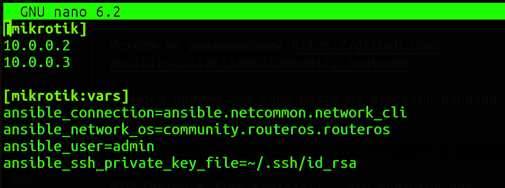</p>

We will also need to pre-install ansible-pylibssh (a library for Ansible that provides an interface for working with SSH connections using the libssh library)
**Or** Paramiko, another popular library for working with SSH in Ansible.

```bash
pip install ansible-pylibssh
```

<details>
<summary><b>The test scenario of the community.routeros module</b></summary>

```yaml
---
- name: RouterOS test with network_cli connection
  hosts: mikrotik
  gather_facts: false
  tasks:
    - name: Run a command
      community.routeros.command:
        commands:
          - /system resource print
      register: system_resource_print
    - name: Print its output
      ansible.builtin.debug:
        var: system_resource_print.stdout_lines

    - name: Retrieve facts
      community.routeros.facts:
    - ansible.builtin.debug:
        msg: "First IP address: {{ ansible_net_all_ipv4_addresses[0] }}"
```

</details>
It was executed successfully:
* Information about the system resources of both RouterOS is displayed;
* Collected facts about the device, such as the RouterOS version, IP addresses, and other parameters.

<p align="center">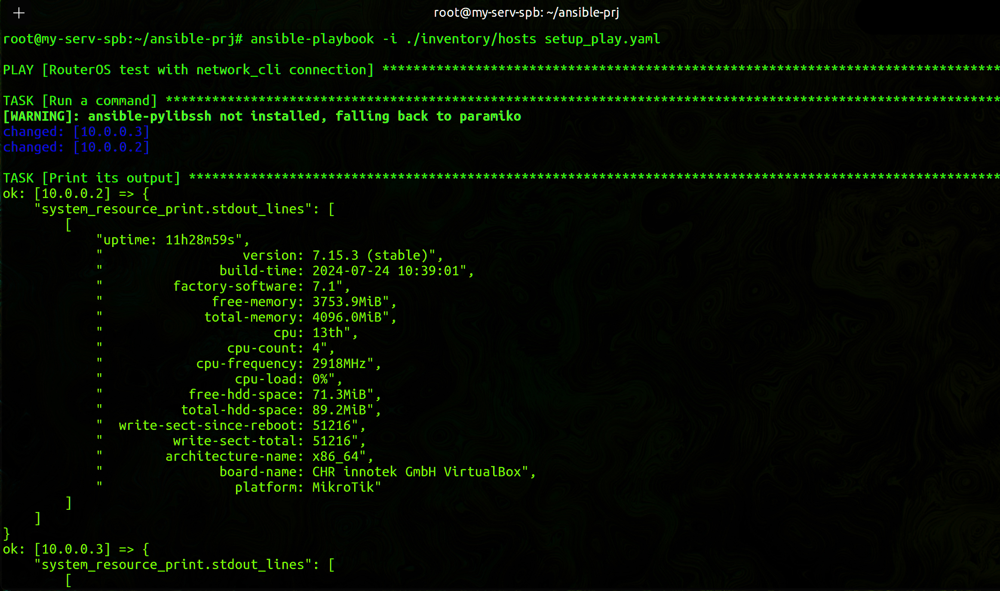</p>

Now let's update this template for our tasks: change the password (I didn't change the login, it's not convenient), add the NTP Client

NTP (Network Time Protocol) is a protocol for time synchronization on computers and network devices. It allows devices on the network to keep accurate time by receiving it from specialized NTP servers.

```yaml
---
- name: Setup MikroTik CHR
  hosts: mikrotik
  gather_facts: no
  tasks:
    # Setting up a username and password
    - name: Set admin login credentials
      community.routeros.command:
        commands:
          - /user set admin password="QWERTY"
      register: user_verify
      ignore_errors: no

    - name: Verify Сhanges
      ansible.builtin.debug:
        msg: "Ну есть жеееее, работает"

    - name: Show user change result
      ansible.builtin.debug:
        msg: |
          "The orders are changing, the password is locked {{inventory_hostname }}:{{ user_verify }}"

    # Configuring the NTP Client
    - name: Configure NTP Client
      community.routeros.command:
        commands:
          - /system ntp client set enabled=yes mode=unicast
          - /system ntp client servers add address=216.239.35.4
          - /system ntp client servers add address=216.239.35.8 # google NTP servers
          - /system ntp client print
      register: ntp_result
      ignore_errors: no
```

<p align="center">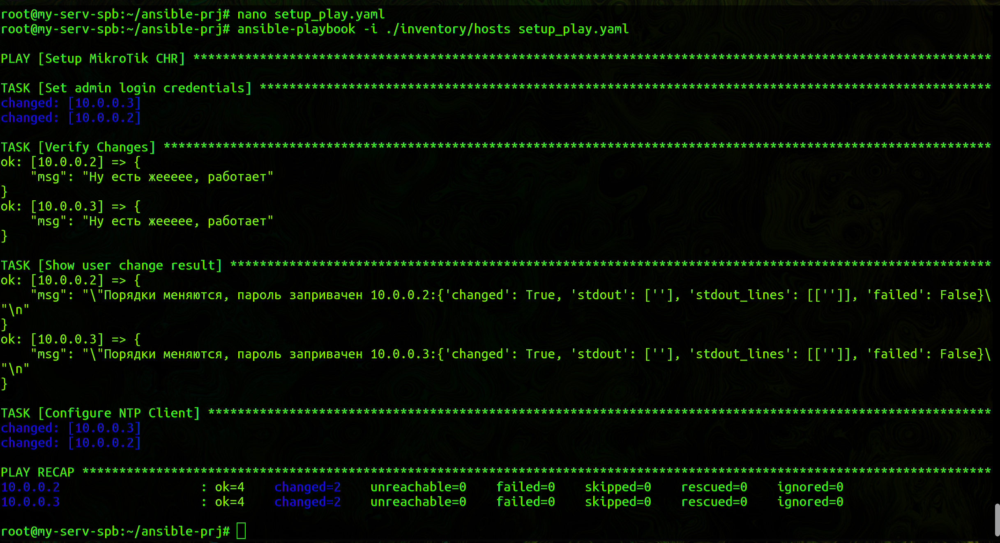</p>

<p align="center">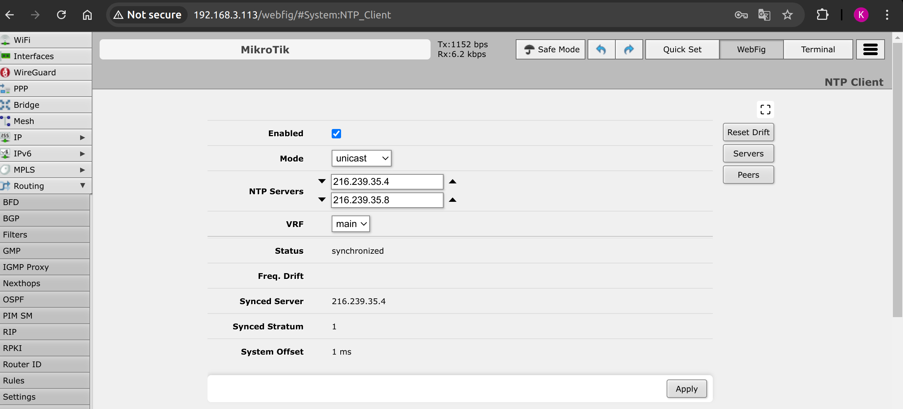</p>

Next, we update the script, add OSPF with the Router ID, and collect data on the OSPF topology and full device configuration.

OSPF is an Internal Gateway Protocol (IGP) designed to distribute routing information between routers belonging to the same autonomous system (AS).

In MikroTik, RouterOS is used to add a network interface to a specific zone. OSPF area=backbone: Specifies that the network interface should be added to the OSPF zone, which is called "backbone" (the main OSPF zone with the identifier 0.0.0.0).
An OSPF zone (Area) is a logical group of OSPF devices inside an autonomous system (AS). OSPF divides the network into zones, and each router in the zone knows about all routes within this zone.

**!!In order for the OSPF settings to work, you need to update the configuration of the wireguard network interfaces by adding the multicast address 224.0.0.5/32 to the Allowed Addresses, as well as the Router-Id address of the loopback interface!**

<p align="center">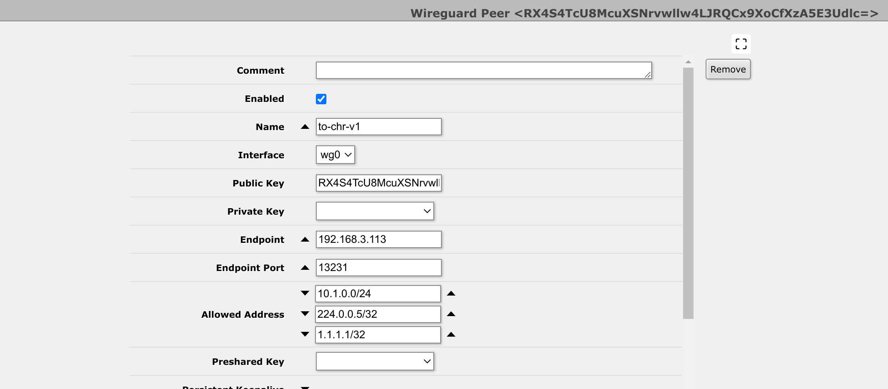</p>

```yaml
  - name: Configure OSPF with specific Router ID for each CHR
    community.routeros.command:
      commands:
        - /ip address add address={{ router_id }} interface=lo
        - /routing ospf instance add disabled=no name=skynet router-id={{ router_id }} redistribute=connected,static
        - /routing ospf area add disabled=no instance=skynet name=backbone
        - /routing ospf interface-template add area=backbone cost=100 disabled=no type=ptp interfaces={{ router_int }}
    vars:
      router_id: "{{ '1.1.1.1' if ansible_host == '10.0.0.2' else '3.3.3.3' }}"
      router_int: "{{ 'wg2' if ansible_host == '10.0.0.2' else 'wg0' }}"

- name: OSPF topology data
  community.routeros.command:
    commands:
      - /routing/ospf/neighbor/print
      - /routing/ospf/interface/print
      - /routing/ospf/area/print
      - /routing/ospf/instance/print
  register: ospf_data

  - name: Get full device configuration
    community.routeros.command:
      commands:
        - /export
    register: full_config

  - name: Print OSPF data
    ansible.builtin.debug:
      var: ospf_data

  - name: Print full device configuration
    ansible.builtin.debug:
      var: full_config

```

Information about OSPF and the device configuration is contained in the ospf_data and full_config variables.

### <a name="section3.4">Accomplishment</a>

<p align="center">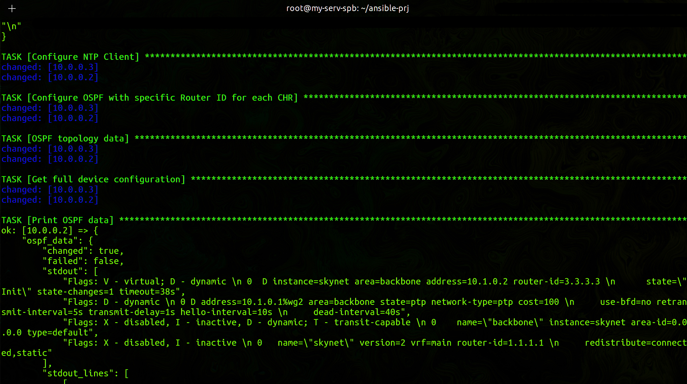</p>

<p align="center">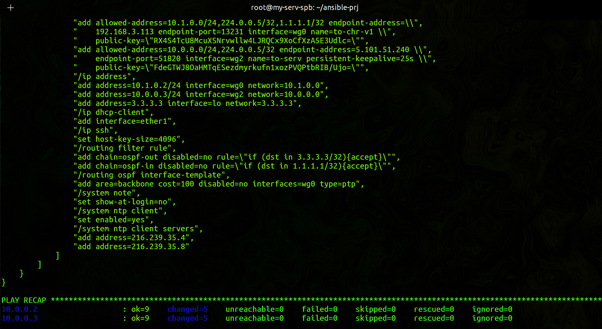</p>

### <a name="section3.3">Result (configured by ospf between CHR)</a>

- CHR-V1
<p align="center">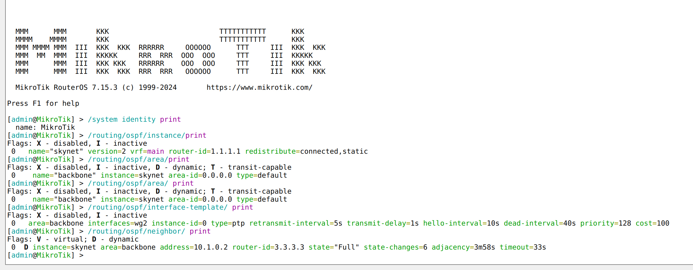</p>

- CHR-V2
<p align="center">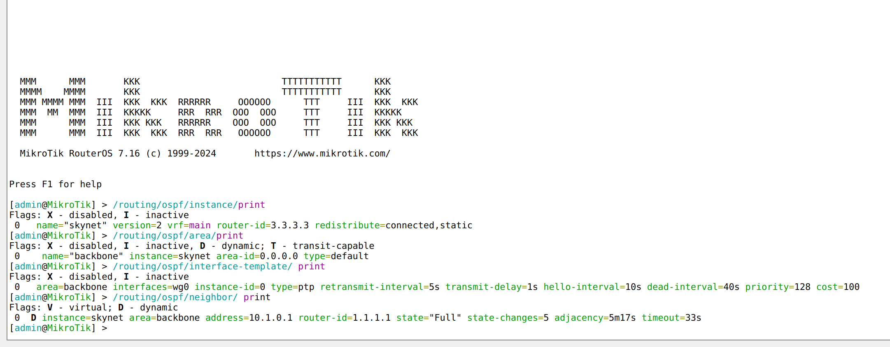</p>

<p align="center">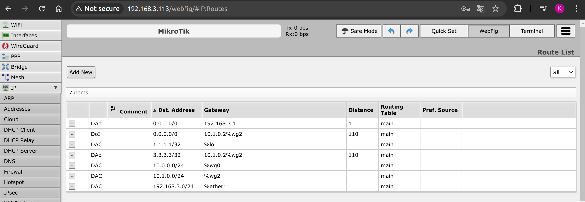</p>

<p align="center">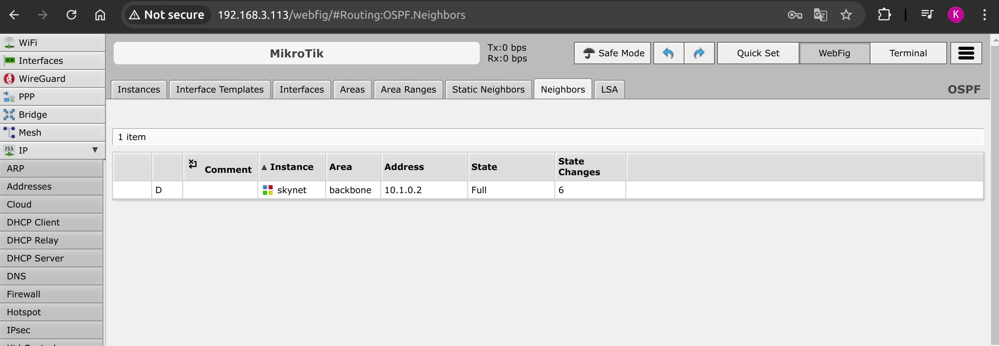</p>

<p align="center">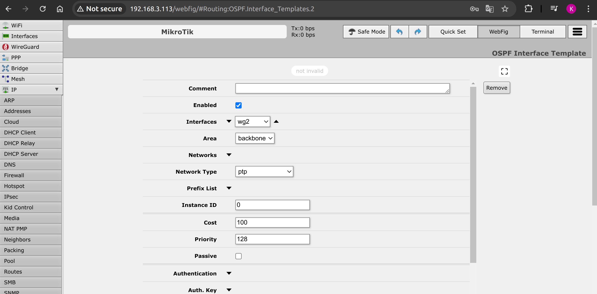</p>

## <a name="section4">Conclusion</a>

During this laboratory work, OSPF was configured via Fireguard on MikroTik, NTP Client, and authorization using Ansible
