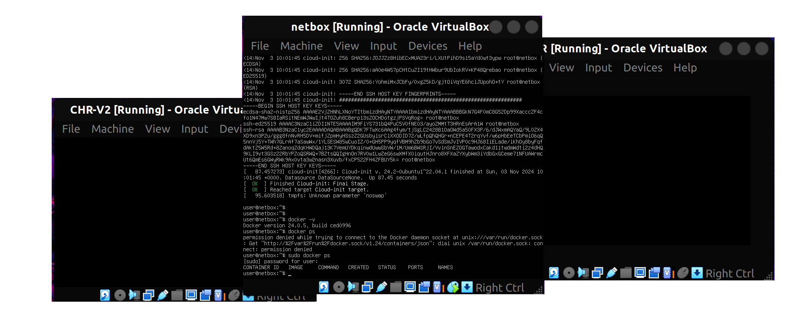
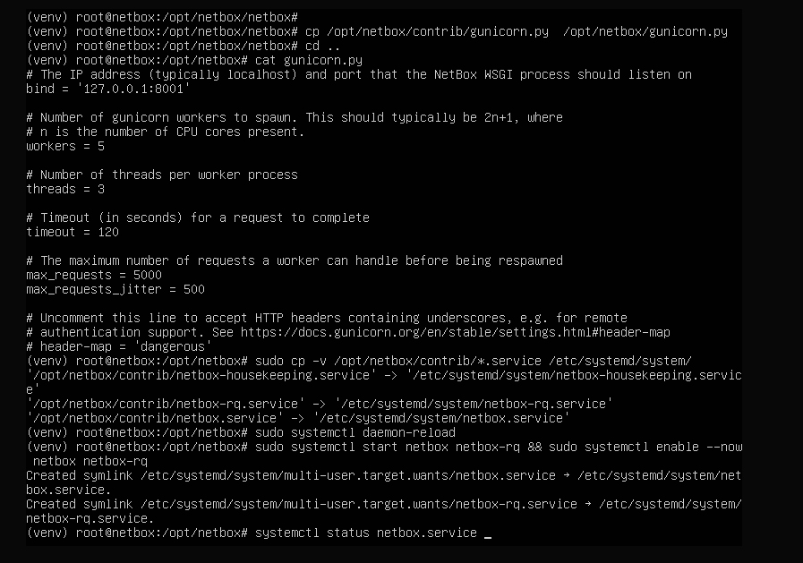
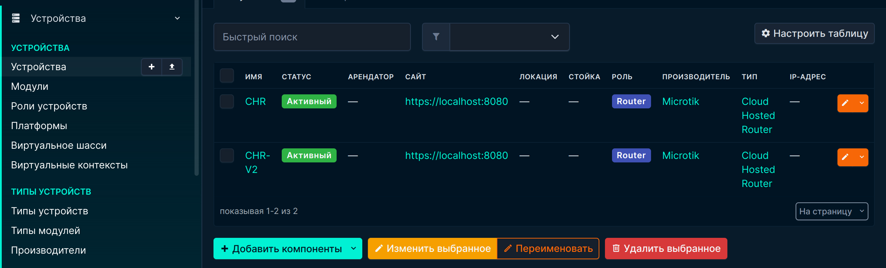
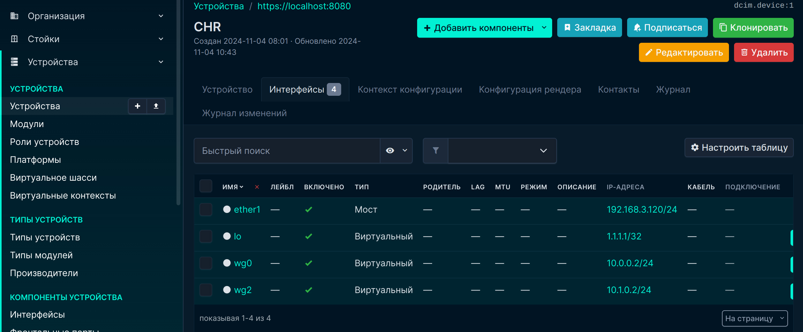
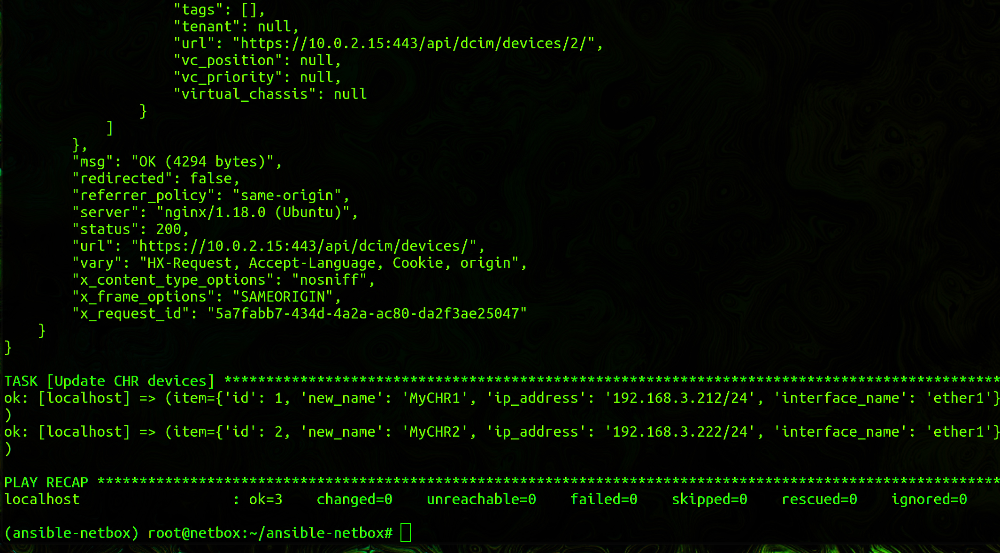

University: [ITMO University](https://itmo.ru/ru/)  
Faculty: [FICT](https://fict.itmo.ru)  
Course: [Network programming](https://github.com/itmo-ict-faculty/network-programming)  
Year: 2024/2025  
Group: K3320  
Author: Kirollos Rezkallah  
Lab: Lab3  
Date of create: 08.05.2025  
Date of finished: 10.05.2025

## Lab #3 "Netbox deployment, communication network as a source of truth in the Netbox Technical Accounting system"

## <a name="section1">Description</a>

In this lab, you will learn about the integration of Ansible and Netbox and learn how to collect information using this integration.

## <a name="section2">The purpose of the work</a>

Use Ansible and Netbox to collect all possible information about the devices and save them in a separate file.

## <a name="section3">Progress of work</a>

### <a name="section3.1">Installation NetBox</a>

Netbox installation Documentation
https://netboxlabs.com/docs/netbox/en/stable/installation/

Ansible+Netbox Documentation
https://netboxlabs.com/blog/getting-started-with-network-automation-netbox-ansible/

Netbox is an open web application designed to manage and document computer networks.

Covers aspects of:

- IP address management (IPAM) — IP networks and addresses, VRFs, and VLAN
- DataCenter infrastructure management (DCIM) — organization of rack equipment by groups and devices
- Devices — device types and installation location
- Connections — network, console, power connections
- Virtualization — virtual machines and clusters
- Data transmission schemes — long-distance communication schemes and providers
- Secrets — encrypted storage of confidential credentials

Launching netbox from the official github on a new vm

<p align="center"></p>

We install postgresql, create a database, a user, and set privileges

<p align="center"></p>

Redis is an in—memory key and value store used by NetBox for caching and queuing background tasks. Redis usually requires minimal configuration; listed in ~/netbox/configuration_example.py It will be enough

<p align="center"></p>

```bash
sudo apt install -y python3 python3-pip python3-venv python3-dev build-essential libxml2-dev libxslt1-dev libffi-dev libpq-dev libssl-dev zlib1g-dev
```

Next, we clone the netbox repository from gita

<p align="center"></p>

<p align="center"></p>

After setting up configurate.py (and secret key generation `python 3 ./generate_secret_key.py `) run the packaged update script ( upgrade.sh ) to perform the following actions:

- Create a Python virtual environment
- Install all necessary Python packages
- Perform database schema migration
- Create documentation locally (for offline use)
- Merge static resource files on yandex.disk

<p align="center"></p>

<p align="center"></p>

Creating a superuser

<p align="center"></p>

We forward the port from the VM to the host and open the running netbox (behind the django server for testing)

<p align="center"></p>

The Gunicorn setup (WSGI is a simple calling convention for web servers that allows requests to be forwarded to web applications or frameworks written in the Python programming language) and nginx, as otherwise it will be impossible to add new devices.

NetBox works as a WSGI application behind an HTTP server.

<p align="center"></p>

<p align="center"></p>

<p align="center"></p>

<p align="center"></p>

<p align="center"></p>

Pushing additional ports

<p align="center"></p>

We issued the certificate ourselves, so the connection is not secure.

<p align="center"></p>

### <a name="section3.2">Работа с NetBox</a>

We create the device type, its role, platform, and add the devices themselves and information about them.

<p align="center"></p>

<p align="center"></p>

Creating a new token

<p align="center"></p>

### <a name="section3.3">Ansible + NetBox</a>

(Work with Ansible is performed on an additional VM with Netbox)

Let's add NetBox to the Ansible inventory. Creating a file named netbox_inventory.yml

```yaml
---
plugin: netbox.netbox.nb_inventory
api_endpoint: https://10.0.2.15:443/
token: tut token kotory sdelali
validate_certs: False
config_context: False
```

Checking the inventory `(ansible-netbox) root@netbox:~/ansible-netbox# ansible-inventory -v --list -i netbox_inventory.yml`

Inventory (a file or set of files that contains information about hosts (servers). The inventory determines which hosts are available to execute playbooks)

<p align="center"></p>

The output result shows that Ansible has successfully connected to NetBox and received device data. In this case, the output includes two devices, CHR and CHR-V2.

\_meta: It contains hostvars information about each device.
CHR and CHR-V2:

- device_roles: router (the role of the device).
- device_types: cloud-hosted-router.
- manufacturers: microtik.
- platforms: main.
- sites: httpslocalhost8080.
- status: Active.

Using the `ansible-inventory --list -i' command netbox_inventory.xml > inventory_output.json` save the information in json format to the file inventory_output.json

"there was an INI format in lab2, now yaml"

<p align="center"></p>

Let's launch the test playbook (the devices were also given a primary ip and a random serial number in the netbox)

<p align="center"></p>

<p align="center"></p>

The Playbook netbox_main.yml works from the uri, since I didn't have time to figure out the plugin netbox.

```yaml
---
- name: Gather device information including interfaces and IPs from NetBox
  hosts: localhost
  connection: local
  gather_facts: false
  vars:
    netbox_url: "https://10.0.2.15:443"
    netbox_token: "tut token"

  tasks:
    - name: Get all devices from NetBox
      uri:
        url: "{{ netbox_url }}/api/dcim/devices/"
        headers:
          Authorization: "Token {{ netbox_token }}"
        validate_certs: false
        return_content: true
      register: devices_response

    - name: Get interfaces for each device and combine with devices
      uri:
        url: "{{ netbox_url }}/api/dcim/?device={{ item.id }}/interfaces"
        headers:
          Authorization: "Token {{ netbox_token }}"
        validate_certs: false
        return_content: true
      register: interfaces_response
      loop: "{{ devices_response.json.results }}"
      loop_control:
        loop_var: item
      # when: devices_response.json.results is defined

    - name: Build a list of devices with their interfaces
      set_fact:
        devices_with_interfaces: "{{ devices_with_interfaces | default([]) + [{'device': item, 'interfaces': interfaces_response.json.results | default([])}] }}"
      loop: "{{ devices_response.json.results }}"
      loop_control:
        loop_var: item
      # when: interfaces_response is defined and interfaces_response.json is defined

    - name: Save devices and interfaces to JSON file
      copy:
        dest: netbox_devices.json
        content: "{{ devices_with_interfaces | to_json | indent(2) }}"
```

Launch `ansible-playbook -i netbox_inventory.yml netbox_main.yml`

<p align="center"></p>

Changing the name and ip using the example

```yaml
- name: Update device names
  uri:
    url: "{{ netbox_url }}/api/dcim/devices/{{ item.id }}/"
    method: PATCH
    headers:
      Authorization: "Token {{ netbox_token }}"
      Content-Type: "application/json"
    body: >
      {
        "name": "{{ item.new_name }}"
      }
    body_format: json
    validate_certs: false
  loop:
    - { id: 1, new_name: "MyCHR1" }
    - { id: 2, new_name: "MyCHR2" }
```

<p align="center"></p>

<p align="center"></p>

To collect the serial number and send it to netbox

```yml
---
- name: Get Mikrotik Serial Number and Update NetBox
  hosts: mikrotik
  gather_facts: no
  vars:
    netbox_url: "https://10.0.2.15:443"
    netbox_token: "i tut token"

  tasks:
    - name: Gather serial number from MikroTik devices
      community.routeros.command:
        commands:
          - "/system license print"
      register: result

    - name: Extract serial numbers
      set_fact:
        serial_numbers: "{{ serial_numbers | default([]) + [ item | regex_replace('system-id: (\\S+).*', '\\1') ] }}"
      loop: "{{ result.stdout_lines | select('search', 'system-id:') | list }}"
      loop_control:
        loop_var: item

    - name: Show extracted serial numbers in terminal
      debug:
        msg: "{{ serial_numbers }}"

    - name: Update devices in NetBox with serial numbers
      uri:
        url: "{{ netbox_url }}/api/dcim/devices/{{ item.id }}/"
        method: PATCH
        headers:
          Authorization: "Token {{ netbox_token }}"
          Content-Type: "application/json"
        body_format: json
        body:
          serial: "{{ serial_numbers[loop.index0] }}"
        validate_certs: false
      loop: "{{ ansible_play_hosts }}"
      loop_control:
        loop_var: item
      register: netbox_update_result

    - name: Show NetBox update result
      debug:
        var: netbox_update_result
```

## <a name="section4">Conclusion</a>

In the course of work, we configured Ansible with NetBox
