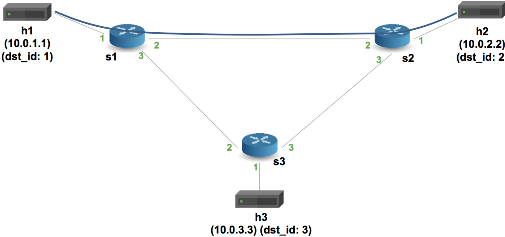

University: [ITMO University](https://itmo.ru/ru/)  
Faculty: [FICT](https://fict.itmo.ru)  
Course: [Network programming](https://github.com/itmo-ict-faculty/network-programming)  
Year: 2024/2025  
Group: K3320  
Author: Kirollos Rezkallah  
Lab: Lab4  
Date of create: 18.05.2025  
Date of finished:21.05.2025

## Laboratory work No. 4 "Basic 'switching' and tunneling using the P4 programming language"

## <a name="section1">Description</a>

In this lab, you will get to know in practice the P4 programming language, developed by Barefoot (now Intel) to organize the process of processing network traffic at the speed of a chip. Barefoot has developed several FPGA chips for traffic processing that have been integrated into some Arista and Brocade switch models.

## <a name="section2">The purpose of the work</a>

Learn the syntax of the P4 programming language and complete 2 training tasks from the Open network foundation to get to know P4 in practice.

## <a name="section2.1">Material</a>

- [P4](#https://p4.org/p4-spec/docs/P4-16-v1.2.3.pdf)
- [p4lang/tutorials](#https://github.com/p4lang/tutorials)
- [Documentation](#https://p4.org/specs/)

## <a name="section3">Progress of work</a>

### <a name="section3.1">Theory</a>

P4 (Programming Protocol-Independent Packet Processors) is a specialized programming language for working with network traffic at the chip level. It was designed to create programmable network devices such as switches, routers, or network adapters.

P4 programs describe packet processing in a programmable network device. The architecture is divided into several stages:

1. Headers (Headlines).
   Packet headers (for example, Ethernet, IPv4) are determined.

Example:

```css
header ethernet_t {
    bit<48> dstAddr;
    bit<48> srcAddr;
    bit<16> etherType;
}
```

2. Parser (The Parser).
   The logic of extracting headers from packets.

Example:

```css
parser MyParser(packet_in pkt, out headers hdr) {
    state start {
        pkt.extract(hdr.ethernet);
        transition select(hdr.ethernet.etherType) {
            0x0800: parse_ipv4;
            default: accept;
        }
    }
}
```

3. Control (Control logic)  
   Manages the packet processing process.

Example:

```css
control MyIngress(inout headers hdr, inout metadata meta) {
  apply {
    if (hdr.ipv4.isValid()) {
      // Perform actions
    }
  }
}
```

4. Deparser (Reverse Parser)  
   Collects packets for further transmission.

> The main components of P4
> Headers: description of the packet header format.
> Metadata: additional data that is used inside the program.
> Tables: packet processing rules based on header values.
> Actions: a set of instructions executed when the rules in the tables match.
> Control Flow: package processing management in the pipeline.

Portable Network Card Architecture (PNA) is a target architecture that describes the general capabilities of network network cards that process and forward packets between one or more network interfaces and a host system.

The Portable Switch Architecture (PSA) is a target architecture that describes the general capabilities of network switches for packet processing and forwarding.

Network telemetry (INT) is the basis for a data plane to collect and transmit network status information without the need for a control plane.

The Telemetry Report format defines the packet formats for reports from data plane devices to a distributed telemetry monitoring system.

### <a name="section3.2">Preparation</a>

```
git clone https://github.com/p4lang/tutorials.git
```

My Vbox version is 7.1, version 2.2.19 is installed through the apt install vagrant repositories, which does not support new versions of Vbox, newer versions of Vagrant 2.4 also do not do this. I didn't want to downgrade the Vbox version to 6.

<p align="center"></p>

Therefore, we install the binary manually. `vagrant_2.4.3_linux_amd64.zip`, then `unzip vagrant_2.4.3_linux_amd64.zip` and `sudo mv vagrant /usr/bin/`

We are also forcibly changing the version output for the VBoxManage tool in /usr/bin/VBox.

```
    VirtualBoxVM|virtualboxvm)
        exec "$INSTALL_DIR/VirtualBoxVM" "$@"
        ;;
    VBoxManage|vboxmanage)
    ########################
        if [[ $@ == "--version" ]]; then
           echo "7.0.0r164728"
        else
           exec "$INSTALL_DIR/VBoxManage" "$@"
        fi
        ;;
    ########################
    VBoxSDL|vboxsdl)
        exec "$INSTALL_DIR/VBoxSDL" "$@"
        ;;
```

It's not very cool, but the VM is being created.

<p align="center"></p>

As you can see in the screenshot, the VM does not seem to be created completely and for some reason without a gui, although the line `vb.gui = true` is in the vagrantfile, I assumed this was due to the fact that there was very little space on my Linux system, so I did the same on windows, but the problem persisted.

I don't know for what reasons, it was I who couldn't just create a VM, but I solved it by slightly editing the vagrantfile, namely enabling support for Intel VT-x and AMD-V virtualization

```
vb.customize ["modifyvm", :id, "--nested-hw-virt", "on"]
vb.customize ["modifyvm", :id, "--ioapic", "on"]
```

<p align="center"></p>

### <a name="section3.3">Implementing Basic Forwarding</a>

The purpose of this exercise is to write a P4 program that implements basic forwarding.

When forwarding IPv4, the switch must perform the following actions for each packet: (1) update the source and destination MAC addresses, (2) reduce the lifetime (TTL) in the IP header, and (3) forward the packet through the appropriate port.

Your switchboard will have one table, which the control plane will fill with static rules. Each rule will map an IP address to a MAC address and an output port for the next hop.

For this exercise, we will use the following topology.

<p align="center"></p>

In the tutorials/exercises/basic directory, using the `make run` command, we raised the Mininet virtual network by compiling basic.p4

<p align="center"></p>

ping failed because each switch is programmed according to basic.p4, which drops all packets.

Add ipv4 and ethernet headers to the parser

<p align="center"></p>

We will set the input port for ipv4 forwarding, update the source mac addresses and destination addresses, change the TTL values, and add routing tables and IPv4 header verification conditions.

<p align="center"></p>

We will also write a parser. It selects the order in which fields are inserted into the outgoing package.

<p align="center"></p>

Checking it out

<p align="center"></p>

<details>
<summary>Here is the full basic.p4 code</summary>

```c
/* -*- P4_16 -*- */
#include <core.p4>
#include <v1model.p4>

const bit<16> TYPE_IPV4 = 0x800;

/*************************************************************************
*********************** H E A D E R S  ***********************************
*************************************************************************/

typedef bit<9>  egressSpec_t;
typedef bit<48> macAddr_t;
typedef bit<32> ip4Addr_t;

header ethernet_t {
    macAddr_t dstAddr;
    macAddr_t srcAddr;
    bit<16>   etherType;
}

header ipv4_t {
    bit<4>    version;
    bit<4>    ihl;
    bit<8>    diffserv;
    bit<16>   totalLen;
    bit<16>   identification;
    bit<3>    flags;
    bit<13>   fragOffset;
    bit<8>    ttl;
    bit<8>    protocol;
    bit<16>   hdrChecksum;
    ip4Addr_t srcAddr;
    ip4Addr_t dstAddr;
}

struct metadata {
    /* empty */
}

struct headers {
    ethernet_t   ethernet;
    ipv4_t       ipv4;
}

/*************************************************************************
*********************** P A R S E R  ***********************************
*************************************************************************/

parser MyParser(packet_in packet,
                out headers hdr,
                inout metadata meta,
                inout standard_metadata_t standard_metadata) {

    state start { transition parse; }

    state parse{
      packet.extract(hdr.ethernet);
      transition select(hdr.ethernet.etherType) {
        TYPE_IPV4: parse_ipv4;
        default: accept;
        }
    }

    state parse_ipv4{
      packet.extract(hdr.ipv4);
      transition accept;
    }
}


/*************************************************************************
************   C H E C K S U M    V E R I F I C A T I O N   *************
*************************************************************************/

control MyVerifyChecksum(inout headers hdr, inout metadata meta) {
    apply {  }
}


/*************************************************************************
**************  I N G R E S S   P R O C E S S I N G   *******************
*************************************************************************/

control MyIngress(inout headers hdr,
                  inout metadata meta,
                  inout standard_metadata_t standard_metadata) {
    action drop() {
        mark_to_drop(standard_metadata);
    }

    action ipv4_forward(macAddr_t dstAddr, egressSpec_t port) {
        standard_metadata.egress_spec= port; // Changing the port
        hdr.ethernet.srcAddr = hdr.ethernet.dstAddr; // Changing the source address to your own
        hdr.ethernet.dstAddr = dstAddr; // Setting up a new recipient
        hdr.ipv4.ttl = hdr.ipv4.ttl - 1; // Decrementing TTL
    }

    table ipv4_lpm {
        key = {
            hdr.ipv4.dstAddr: lpm;
        }
        actions = {
            ipv4_forward;
            drop;
            NoAction;
        }
        size = 1024;
        default_action = NoAction();
    }

    apply {
        if (hdr.ipv4.isValid()) {
            ipv4_lpm.apply();
        }
    }
}

/*************************************************************************
****************  E G R E S S   P R O C E S S I N G   *******************
*************************************************************************/

control MyEgress(inout headers hdr,
                 inout metadata meta,
                 inout standard_metadata_t standard_metadata) {
    apply {  }
}

/*************************************************************************
*************   C H E C K S U M    C O M P U T A T I O N   **************
*************************************************************************/

control MyComputeChecksum(inout headers hdr, inout metadata meta) {
     apply {
        update_checksum(
            hdr.ipv4.isValid(),
            { hdr.ipv4.version,
              hdr.ipv4.ihl,
              hdr.ipv4.diffserv,
              hdr.ipv4.totalLen,
              hdr.ipv4.identification,
              hdr.ipv4.flags,
              hdr.ipv4.fragOffset,
              hdr.ipv4.ttl,
              hdr.ipv4.protocol,
              hdr.ipv4.srcAddr,
              hdr.ipv4.dstAddr },
            hdr.ipv4.hdrChecksum,
            HashAlgorithm.csum16);
    }
}


/*************************************************************************
***********************  D E P A R S E R  *******************************
*************************************************************************/

control MyDeparser(packet_out packet, in headers hdr) {
    apply {
        packet.emit(hdr.ethernet);
        packet.emit(hdr.ipv4);
    }
}

/*************************************************************************
***********************  S W I T C H  *******************************
*************************************************************************/

V1Switch(
MyParser(),
MyVerifyChecksum(),
MyIngress(),
MyEgress(),
MyComputeChecksum(),
MyDeparser()
) main;
```

</details>

### <a name="section3.4">Implementing Basic Tunneling</a>

The basic_tunnel.p4 file contains the implementation of the basic IP router. It also contains comments marked with TODO that indicate the functionality that you need to implement. The full implementation of the basic_tunnel.p4 switch will be able to forward based on the contents of the custom encapsulation header, as well as perform normal IP forwarding if the encapsulation header is missing from the packet.

Your task will be to perform the following actions:

Note: A new myTunnel_t header type has been added, which contains two 16-bit fields: proto_id and dst_id.
NOTE: The myTunnel_t header has been added to the headers structure.
TODO: Update the parser to extract the myTunnel header or ipv4 header based on the EtherType field in the Ethernet header. The EtherType corresponding to the myTunnel header is 0x1212. The parser should also extract the ipv4 header after the myTunnel header if proto_id == TYPE_IPV4 (i.e. 0x0800).
TODO: Define a new action called myTunnel_forward, which simply sets the exit port (i.e. egress_spec field of the standard_metadata bus) to the port number provided by the control plane.
TODO: Define a new myTunnel_exact table that performs an exact match on the dst_id field of the myTunnel header. This table should trigger the myTunnel_forward action if there is a match in the table, and should trigger the drop action otherwise.
TODO: Update the apply statement in the MyIngress control block to apply your newly defined myTunnel_exact table if
TODO: Update the deparer so that it outputs ethernet headers, then myTunnel, then ipv4. Remember that the deparer will only return the header if it is valid. The implicit header validity bit is set by the parser during extraction. Therefore, there is no need to check the validity of the header here.
TODO: Add static rules for your new table so that switches correctly forward for each possible dst_id value. The diagram below shows the configuration of the topology ports, as well as how we will assign IDs to the hosts. For this step, you will need to add the forwarding rules to the sX-runtime.json files.

Type of scheme:

<p align="center"></p>

Working in a file exercises/basic_tunnel/basic_tunnel.p4

The parser so that it extracts either the myTunnel header or the ipv4 header based on the EtherType of the field in the Ethernet header and the dispatcher

<p align="center"></p>

<p align="center"></p>

Let's create an action named myTunnel_forward, which will set the exit port and add a table similar to ipv4_lpm, but in this case the forwarding has been replaced with tunnel forwarding. Update the apply block in the MyIngress control to apply the new myTunnel_exact table.

<p align="center"></p>

Now let's launch the mini net and check the connectivity `mininet> xterm h1 h2`

Testing transmission without tunneling:

In terminal h1, we will start the server `./receive.py` and we will send a message from another node.: `./send.py 10.0.2.2 "P4 is cool"`

<p align="center"></p>

We will see the following components:

- Ethernet-heading
- IP-heading
- TCP-heading
- Message
  If you change the destination IP address (for example, try to send to 10.3), the message will not be delivered to h2, but instead will be received by h3.

Now testing with tunneling:
In the h1 terminal, we do `./send.py 10.0.2.2 "P4 is cool" --dst_id 2`

<p align="center"></p>

The message will be delivered to h2. When analyzing the package, you will see:

- Ethernet header
- Tunnel heading
- IP header
- TCP header
- Message

Now we will change the destination IP address when sending a message from node h1, but leave the id h2. `./send.py 10.0.3.3 "P4 is cool" --dst_id 2`

<p align="center"></p>

<details>
<summary> Here is the full code of basic_tunnel.p4</summary>

```c
/* -*- P4_16 -*- */
#include <core.p4>
#include <v1model.p4>

// NOTE: new type added here
const bit<16> TYPE_MYTUNNEL = 0x1212;
const bit<16> TYPE_IPV4 = 0x800;

/*************************************************************************
*********************** H E A D E R S  ***********************************
*************************************************************************/

typedef bit<9>  egressSpec_t;
typedef bit<48> macAddr_t;
typedef bit<32> ip4Addr_t;

header ethernet_t {
    macAddr_t dstAddr;
    macAddr_t srcAddr;
    bit<16>   etherType;
}

// NOTE: added new header type
header myTunnel_t {
    bit<16> proto_id;
    bit<16> dst_id;
}

header ipv4_t {
    bit<4>    version;
    bit<4>    ihl;
    bit<8>    diffserv;
    bit<16>   totalLen;
    bit<16>   identification;
    bit<3>    flags;
    bit<13>   fragOffset;
    bit<8>    ttl;
    bit<8>    protocol;
    bit<16>   hdrChecksum;
    ip4Addr_t srcAddr;
    ip4Addr_t dstAddr;
}

struct metadata {
    /* empty */
}

// NOTE: Added new header type to headers struct
struct headers {
    ethernet_t   ethernet;
    myTunnel_t   myTunnel;
    ipv4_t       ipv4;
}

/*************************************************************************
*********************** P A R S E R  ***********************************
*************************************************************************/

// TODO: Update the parser to parse the myTunnel header as well
parser MyParser(packet_in packet,
                out headers hdr,
                inout metadata meta,
                inout standard_metadata_t standard_metadata) {

    state start {
        transition parse_ethernet;
    }

    state parse_ethernet {
        packet.extract(hdr.ethernet);
        transition select(hdr.ethernet.etherType) {
            TYPE_MYTUNNEL: parse_myTunnel;
            TYPE_IPV4: parse_ipv4;
            default: accept;
        }
    }

    state parse_myTunnel {
        packet.extract(hdr.myTunnel);
        transition select(hdr.myTunnel.proto_id) {
            TYPE_IPV4: parse_ipv4;
            default: accept;
        }
    }

    state parse_ipv4 {
        packet.extract(hdr.ipv4);
        transition accept;
    }

}

/*************************************************************************
************   C H E C K S U M    V E R I F I C A T I O N   *************
*************************************************************************/

control MyVerifyChecksum(inout headers hdr, inout metadata meta) {
    apply {  }
}


/*************************************************************************
**************  I N G R E S S   P R O C E S S I N G   *******************
*************************************************************************/

control MyIngress(inout headers hdr,
                  inout metadata meta,
                  inout standard_metadata_t standard_metadata) {
    action drop() {
        mark_to_drop(standard_metadata);
    }

    action ipv4_forward(macAddr_t dstAddr, egressSpec_t port) {
        standard_metadata.egress_spec = port;
        hdr.ethernet.srcAddr = hdr.ethernet.dstAddr;
        hdr.ethernet.dstAddr = dstAddr;
        hdr.ipv4.ttl = hdr.ipv4.ttl - 1;
    }

    table ipv4_lpm {
        key = {
            hdr.ipv4.dstAddr: lpm;
        }
        actions = {
            ipv4_forward;
            drop;
            NoAction;
        }
        size = 1024;
        default_action = drop();
    }

    // TODO: declare a new action: myTunnel_forward(egressSpec_t port)
    action myTunnel_forward(egressSpec_t port) {
        standard_metadata.egress_spec = port;
    }

    // TODO: declare a new table: myTunnel_exact
    table myTunnel_exact {
        key = {
            hdr.myTunnel.dst_id: exact;
        }
        actions = {
            myTunnel_forward;
            drop;
        }
        size = 1024;
        default_action = drop();
    }
    // TODO: also remember to add table entries!
    apply {
        // TODO: Update control flow
        if (hdr.ipv4.isValid() && !hdr.myTunnel.isValid()) {
            ipv4_lpm.apply();
        }

        if (hdr.myTunnel.isValid()) {
            myTunnel_exact.apply();
        }
    }
}

/*************************************************************************
****************  E G R E S S   P R O C E S S I N G   *******************
*************************************************************************/

control MyEgress(inout headers hdr,
                 inout metadata meta,
                 inout standard_metadata_t standard_metadata) {
    apply {  }
}

/*************************************************************************
*************   C H E C K S U M    C O M P U T A T I O N   **************
*************************************************************************/

control MyComputeChecksum(inout headers  hdr, inout metadata meta) {
     apply {
        update_checksum(
            hdr.ipv4.isValid(),
            { hdr.ipv4.version,
              hdr.ipv4.ihl,
              hdr.ipv4.diffserv,
              hdr.ipv4.totalLen,
              hdr.ipv4.identification,
              hdr.ipv4.flags,
              hdr.ipv4.fragOffset,
              hdr.ipv4.ttl,
              hdr.ipv4.protocol,
              hdr.ipv4.srcAddr,
              hdr.ipv4.dstAddr },
            hdr.ipv4.hdrChecksum,
            HashAlgorithm.csum16);
    }
}

/*************************************************************************
***********************  D E P A R S E R  *******************************
*************************************************************************/

control MyDeparser(packet_out packet, in headers hdr) {
    apply {
        packet.emit(hdr.ethernet);
        // TODO: emit myTunnel header as well
        packet.emit(hdr.myTunnel); // Заголовок туннеля
        packet.emit(hdr.ipv4);
    }
}

/*************************************************************************
***********************  S W I T C H  *******************************
*************************************************************************/

V1Switch(
MyParser(),
MyVerifyChecksum(),
MyIngress(),
MyEgress(),
MyComputeChecksum(),
MyDeparser()
) main;
```

</details>

### <a name="section3.2">Conclusion</a>

During this laboratory work, we got acquainted with a specialized programming language for working with network traffic at the chip level - P4 (processor package programming protocol) and completed 2 tasks from the official repository with Git (performing basic forwarding and implementing basic tunneling)
